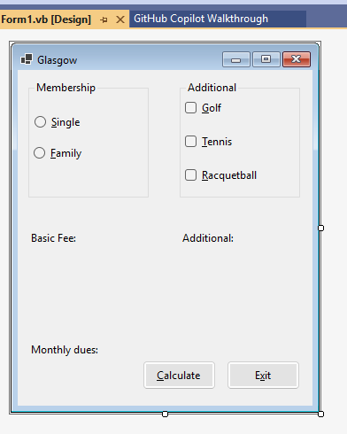

# Membership Dues Calculator

A Visual Basic Windows Forms application that calculates monthly membership dues for club members based on membership type and selected add-on services.

## Application Screenshots

### Main Screen

### Monthly Dues Calculation

## Features

- Supports Single and Family memberships
- Calculates monthly dues automatically
- Allows selection of optional add-on services
- Displays:
  - Basic membership fee
  - Additional charges
  - Total monthly dues
- Uses object-oriented programming principles

## Object-Oriented Design

The application includes a Dues class that demonstrates:

- Auto-implemented properties
- Default constructor
- Parameterized constructor
- Method for calculating total monthly dues

## Technologies Used

- Visual Basic
- Visual Studio
- Windows Forms
- Object-Oriented Programming (OOP)

## Author

Kerri Stotler
